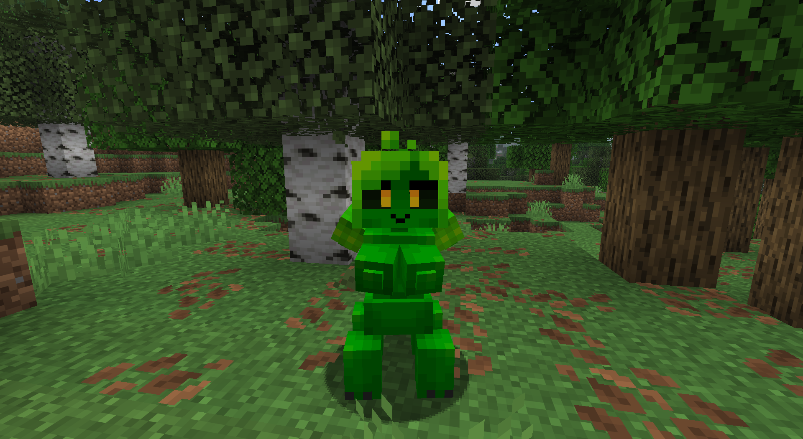
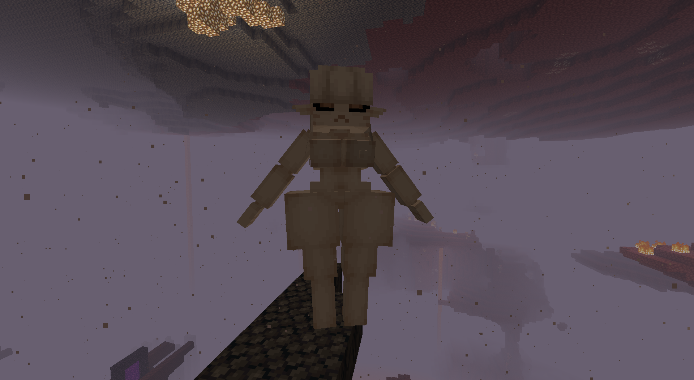
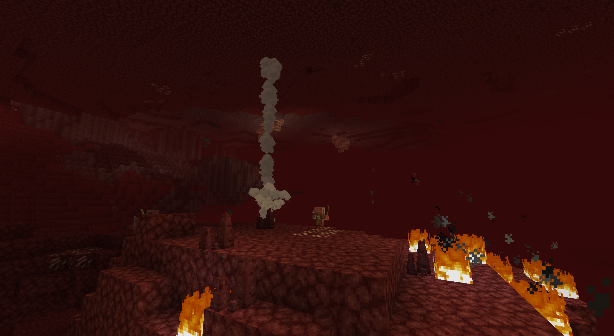

# Inflatable Mob Girls

**Disclaimer:** This project is an unofficial, community-created mod for Minecraft. It is not affiliated with, endorsed by, or sponsored by Mojang Studios or Microsoft. This repository contains only the **source code** and assets that the author has the right to distribute. It does **not** include any Minecraft game files or other proprietary content from Mojang/Microsoft. You must own a legitimate copy of Minecraft to use this mod.

---

## Table of Contents

- [Overview](#overview)
- [Features](#features)
- [Screenshots](#screenshots)
- [Compatibility](#compatibility)
- [Credits](#credits)

---

## Overview

**Inflatable Mob Girls** introduces playful, fully animated inflatable variants of vanilla mobs. Each mob girl has a custom model, unique inflation mechanics, and bespoke sounds and animations. This repository is source-first: build with Gradle to produce the mod jar.

**Current content**

- **Creeper Girl**: inflatable creeper variant with its own inflation behavior and sounds.
- **Ghast Girl**: inflatable ghast variant with unique inflation mechanics and sounds.

---

## Features

- **Inflatable variants** of vanilla mobs.
- **Fully custom models and animations** for each mob girl.
- **Unique inflation mechanics** per mob girl (different growth rates, limits, and interactions).
- **Custom inflation sounds** for each mob girl.

---

## Screenshots

**Creeper Girl**

**Ghast Girl**

**Nether Geyser**

---

## Compatibility

- **Supported Minecraft versions:** **1.20.1**, **26.1.2**, **26.2**.  
- **Mod loaders:** **Neoforge** and **Fabric**. The mod is maintained to track the latest loader versions; check `gradle.properties` and `build.gradle` for exact loader and mapping versions used for each branch or tag.

---

## Credits

- [**bARTek**](https://x.com/Irritator_Fan): for the mod concept, Ghast Girl and Creeper Girl models.
- [**CherryBxrry**](https://x.com/CherryMcBerry): for design, code, and maintenance.

